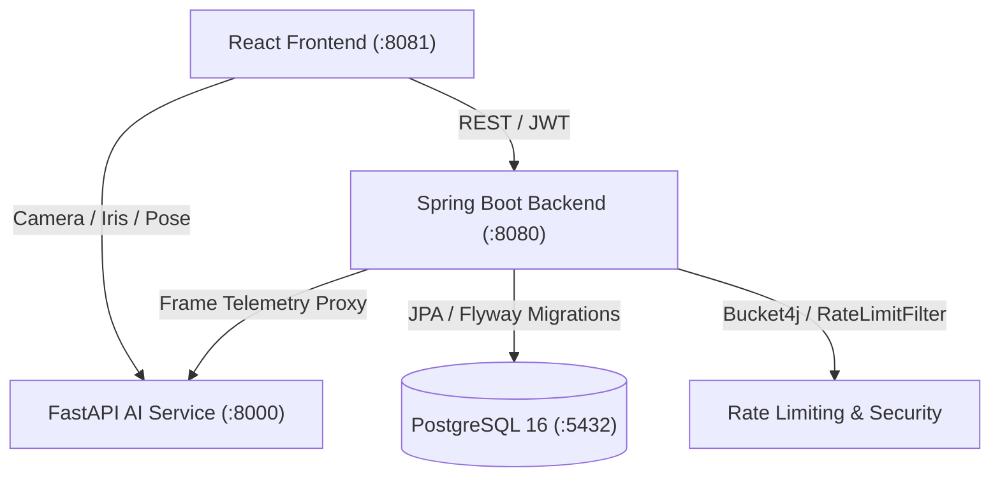

# AI Online Examination & Proctoring System (AEPS)

A production-ready, full-stack online examination and proctoring platform featuring:
- **Backend**: Spring Boot 3 / Java 21, Spring Security, Flyway, PostgreSQL.
- **Frontend**: React 19, TypeScript, Vite, Tailwind CSS v4, Recharts.
- **AI Computer Vision Service**: FastAPI, OpenCV, MediaPipe, ONNX Runtime.
- **Proctoring Engine**: Browser-native signals (tab-switch, fullscreen-exit), webcam face/iris/head-pose analysis, multi-face detection, exponential time-decayed behavioral risk scoring, and multi-tier progressive warnings.
- **Admin Intelligence & Analytics**: Interactive Recharts dashboards, granular attempt filtering (Specifications), full drill-down session inspection, and multi-format report exports (PDF via OpenPDF, Excel via Apache POI, CSV).
- **Security Hardened**: In-memory refresh token rotation & revocation, Bucket4j per-IP rate limiting, comprehensive audit logging, account lockout, and PGP / secret scanning defenses.

---

## Architecture & System Overview



---

## Phase Status Summary

| Phase | Description | Status |
|---|---|---|
| **Phase 1** | Auth, Exam CRUD, MCQ Engine, Student Assignment & Session Verification | ✅ Implemented |
| **Phase 2** | Live Media Streams (Webcam, Mic, Fullscreen, Screen Capture tracking) | ✅ Implemented |
| **Phase 3** | Browser-Native Telemetry (Tab-switch, window-blur, fullscreen-exit) | ✅ Implemented |
| **Phase 4** | Face Detection & Multiple-Face Detection (OpenCV / MediaPipe) | ✅ Implemented |
| **Phase 5** | Gaze & Head-Pose Estimation (SolvePnP & Iris tracking) | ✅ Implemented |
| **Phase 6** | Behavioral Risk Engine (Time-decayed score, progressive warnings) | ✅ Implemented |
| **Phase 7** | Admin Analytics & Reporting (Recharts, PDF/Excel/CSV exports, attempt filter) | ✅ Implemented |
| **Phase 8** | AI Model Scaffolding & Labeling Studio (ONNX classifier, 13-class taxonomy) | ✅ Implemented |
| **Phase 9** | Security Hardening (Refresh tokens, Bucket4j rate limits, audit logging) | ✅ Implemented |

---

## Deploying on Proxmox or Any Linux Host with Docker

The entire platform is containerized with multi-stage Dockerfiles and orchestrated using `docker-compose.yml`. You do **not** need to manually install Java, Maven, or Python on your Proxmox host or VM.

### 1. In Proxmox VE
You can run this either inside:
- **A Proxmox LXC Container** (Debian or Ubuntu template with Docker enabled under Options → Features → `keyctl=1,nesting=1`), or
- **A Standard Linux VM** (Ubuntu Server 22.04/24.04 or Debian 12).

### 2. Install Docker & Docker Compose
On your VM or LXC:
```bash
curl -fsSL https://get.docker.com -o get-docker.sh
sh get-docker.sh
sudo systemctl enable --now docker
```

### 3. Launch the Stack
Clone the repository and spin up all 4 services:
```bash
git clone <your-repo-url> "monitoring-system"
cd "monitoring-system"

# Optional: configure secrets in .env
cp backend/.env.example backend/.env

# Build and start all 4 services (PostgreSQL, Backend, AI Service, Frontend)
docker compose up -d --build
```

### 4. Service Endpoints
- **Frontend Web App**: `http://<YOUR_PROXMOX_IP>:8081`
- **Backend REST API**: `http://<YOUR_PROXMOX_IP>:8080`
- **FastAPI AI Vision Service**: `http://<YOUR_PROXMOX_IP>:8000/docs` (Swagger UI)
- **PostgreSQL Database**: Port `5432`

---

## Local Development (Without Docker)

### Prerequisites
- Node.js 20+
- Java 21+ and Maven (or run backend in Docker)
- Python 3.10+ (for `ai-service`)
- PostgreSQL 16+ running on port 5432

### 1. Database Setup
```bash
# Create examdb database and user
psql -U postgres -c "CREATE USER examuser WITH PASSWORD 'exampass';"
psql -U postgres -c "CREATE DATABASE examdb OWNER examuser;"
```

### 2. Spring Boot Backend
```bash
cd backend
mvn clean install
mvn spring-boot:run
```
Flyway migrations (`V1` through `V7`) will execute automatically on startup.

### 3. AI Computer Vision Service
```bash
cd ai-service
python -m venv .venv
source .venv/bin/activate  # Or on Windows: .venv\Scripts\activate
pip install -r requirements.txt
uvicorn app.main:app --host 0.0.0.0 --port 8000 --reload
```

### 4. React Frontend
```bash
cd frontend
npm install
npm run dev
```

---

## Phase 8: Model Labeling Studio & Training Scaffold

### Interactive Labeling Tool
Open `ai-service/labeler/index.html` directly in any web browser (no server needed).
- Segments exam proctoring recordings into 5-second chunk blocks.
- Allows annotators to tag chunks using the 13-class behavioral taxonomy (`NORMAL`, `LOOKING_LEFT`, `LOOKING_RIGHT`, `LOOKING_UP`, `LOOKING_DOWN`, `HEAD_TURNED`, `FACE_NOT_VISIBLE`, `MULTIPLE_FACES`, `TAB_SWITCH`, `FULLSCREEN_EXIT`, `WEBCAM_LOST`, `MICROPHONE_LOST`, `SUSPICIOUS_POSTURE`).
- Exports clean training CSVs (`session_id, event_type, start_time, end_time, duration, severity`).

### Offline Model Training
```bash
cd ai-service/training
pip install -r requirements-training.txt

# Run temporal 1D-CNN training & export to ONNX
python train.py --epochs 15 --batch-size 32

# Evaluate Precision, Recall, and F1 on held-out test split
python evaluate.py
```
When `best_model.onnx` is produced, the FastAPI service automatically detects and loads it via `OnnxClassifier` for sub-millisecond CPU inference.

---

## Security & Secrets Management (Phase 9)

- **Refresh Tokens**: Admin authentication issues short-lived JWT access tokens and 7-day SHA-256 hashed refresh tokens. Stored strictly in memory on the frontend with automatic transparent rotation and `/api/admin/auth/logout` revocation.
- **Bucket4j Rate Limiting**: Per-IP limits protect against brute-force attacks:
  - `POST /verify-student`: 10 requests / minute
  - `POST /frame`: 60 requests / minute
  - `GET /report/export`: 5 requests / minute
- **Audit Logging**: Consequential actions are persisted into the `audit_logs` table: admin logins, logouts, lockouts, exam publishing, question modifications, student assignments, manual report exports, and automatic system risk flagging.
- **Secrets Management**:
  - Environment variables (`.env`, `application-local.yml`) are ignored by Git via the root `.gitignore`.
  - Automated secret scanning is enforced using `.gitleaks.toml`.
  - For production, inject credentials via Docker environment variables or external secret managers (e.g., Vault, Doppler).
