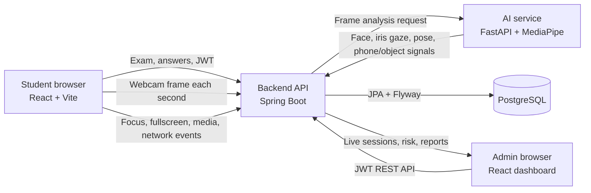
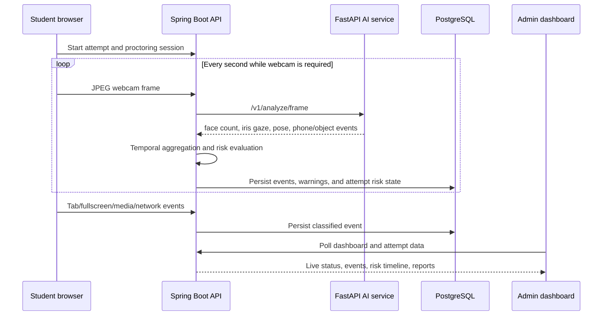

# AI Online Examination & Proctoring System — Architecture

## Purpose

This platform delivers online examinations while monitoring permitted proctoring signals: webcam frames, eye/gaze direction, face presence, multiple faces, mobile devices, browser focus, fullscreen state, screen sharing, microphone state, and connectivity.

The system records those signals as auditable events. It calculates a time-decayed risk score, gives students progressive warnings, and presents administrators with live monitoring and reports. A risk flag is for human review; it is not an automatic cheating verdict.

## System map



## Components

| Component | Location | Responsibility |
|---|---|---|
| Frontend | `frontend/` | Student exam experience, permission checks, webcam preview, frame capture, browser-signal collection, admin dashboard and reports. |
| Backend | `backend/` | Authentication, exam lifecycle, answer handling, session ownership, server-side event classification, risk scoring, reporting, audit logs, rate limiting. |
| AI service | `ai-service/` | Stateless image analysis with MediaPipe models, OpenCV fallback, face/iris gaze/head-pose analysis, multi-face and phone/object detection. |
| Database | PostgreSQL | Durable exam, attempt, proctoring event, warning, and audit records. Schema is versioned with Flyway migrations in `backend/src/main/resources/db/migration/`. |

## Frontend framework

### Student journey

```text
Public exams → Identity verification → System check → Proctoring setup
→ Exam in progress → Automatic/manual submission → Result page
```

Primary pages:

- `frontend/src/pages/student/ExamVerify.tsx` — student verification.
- `frontend/src/pages/student/SystemCheck.tsx` — browser, camera, microphone, fullscreen, screen-share, network, and location readiness.
- `frontend/src/pages/student/ExamTake.tsx` — answers, timer, media acquisition, frame capture, browser-event collection, strikes, and live camera/AI status.
- `frontend/src/hooks/useEventLogger.ts` — queues and batches browser events; flushes them periodically and on unload.

### Admin journey

```text
Admin login → Dashboard → Create/manage an exam → Add questions/assign students
→ Publish → Monitor active attempts → Review/export attempt reports
```

Primary pages:

- `frontend/src/pages/admin/AdminDashboard.tsx` — metrics, charts, and active-session polling.
- `frontend/src/pages/admin/CreateExam.tsx` — creates draft exams.
- `frontend/src/pages/admin/ExamDetail.tsx` — questions, assignment, publish, and attempt management.
- `frontend/src/pages/admin/AdminReportView.tsx` — event/risk timeline and exports.

## Backend framework

### Layering

```text
Controller → Service → Repository → Entity → PostgreSQL
```

- Controllers in `backend/src/main/java/com/proctor/exam/controller/` expose REST endpoints.
- Services contain business rules, security-aware ownership checks, AI proxying, event aggregation, risk scoring, and report generation.
- Repositories encapsulate JPA queries and attempt/event filters.
- Entities map to Flyway-managed PostgreSQL tables.

### Security

- Admin and student routes use short-lived JWT access tokens.
- Admin refresh tokens are rotated and revoked by the backend.
- Roles isolate `/api/admin/**` from `/api/student/**`.
- Bucket4j rate limiting protects student verification, frame upload, and report-export endpoints.
- Audit records preserve consequential actions such as logins, exam publication, assignment, and exports.

## Proctoring and AI framework



### Signal sources

| Signal | Source | Server result |
|---|---|---|
| Tab/app focus loss | Browser visibility and focus listeners | `TAB_SWITCH` event with duration. |
| Fullscreen exit | Browser fullscreen listener | `FULLSCREEN_EXIT` event. |
| Screen/mic/webcam loss | Media stream track listeners | Media-loss events and session status updates. |
| Connectivity loss | Browser online/offline listeners | `CONNECTION_LOST` event with duration. |
| No face / multiple faces | AI frame analysis + temporal aggregation | `FACE_NOT_VISIBLE` / `MULTIPLE_FACES`. |
| Eye gaze / head turn | MediaPipe facial landmarks, iris ratios, and pose | `LOOKING_*` / `HEAD_TURNED` after temporal thresholds. |
| Mobile phone / object | MediaPipe EfficientDet model | `CELL_PHONE_DETECTED` / `PROHIBITED_OBJECT_DETECTED`. |

### Risk and warnings

`RiskEngine` assigns weights to event types and applies continuous exponential time decay. Warning tiers are:

| Risk score | Action |
|---:|---|
| 0–24 | No warning |
| 25–49 | Tier 1 notice |
| 50–74 | Tier 2 warning |
| 75+ | Tier 3 critical warning and flag for human review |

The student page also has a three-strike UI enforcement flow. Server-side records remain the authoritative audit trail.

## Database framework

Core tables:

```text
admins ──< exams ──< exam_questions
                    └──< exam_assignments

exams ──< exam_attempts ──< exam_answers
                         └──  proctoring_sessions ──< proctoring_events
                                                        └── warnings

audit_logs
refresh_tokens
```

## Main API groups

| Group | Base route | Purpose |
|---|---|---|
| Public exams | `/api/exams` | List open exams and verify a student. |
| Student exams | `/api/student` | Start, answer, and submit an attempt. |
| Student proctoring | `/api/student/attempts/{attemptId}/proctoring` | Session, heartbeats, browser events, frames, and warnings. |
| Admin auth | `/api/admin/auth` | Login, refresh, and logout. |
| Admin exams | `/api/admin/exams` | Drafts, questions, assignments, and publishing. |
| Admin monitoring | `/api/admin` | Dashboard, attempt events, risk timelines, reports, and exports. |
| AI analysis | `/v1/analyze/frame` | FastAPI endpoint used internally by Spring Boot. |

## Local runtime

| Service | Port | Command |
|---|---:|---|
| PostgreSQL | 5432 | Run PostgreSQL with database `examdb` and user `examuser`. |
| Backend | 8080 | `backend\\mvnw.cmd spring-boot:run` |
| AI service | 8000 | `ai-service\\.venv\\Scripts\\python.exe -m uvicorn app.main:app --host 0.0.0.0 --port 8000 --reload` |
| Frontend | 5173 | `frontend\\npm.cmd run dev` |

The backend must be running with PostgreSQL before admin actions such as creating an exam can persist data. The AI service health endpoint is `http://localhost:8000/health`.

## Operational rule

AI detections are evidence signals, not final judgments. The intended workflow is automated recording and risk flagging followed by administrator review of the event timeline and report.
