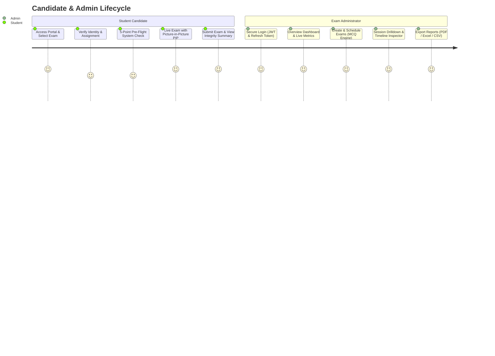
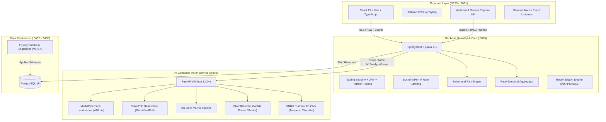

# AI Online Examination & Proctoring System (AEPS) — Functional Specification & Architecture Guide

## 1. Executive Summary & Website Purpose

The **AI Online Examination & Proctoring System (AEPS)** is an enterprise-grade, full-stack web application engineered to conduct high-stakes academic and professional assessments remotely while actively preserving academic integrity.

### The Core Problem Solved
Traditional remote examination software either relies on invasive, resource-heavy desktop spyware or falls prey to common cheating techniques, such as:
- Using mobile phones or secondary screens off-camera.
- Having another person present in the room or answering on behalf of the student.
- Switching browser tabs to search for answers with search engines or AI assistants.
- Looking away from the screen for extended periods (crib sheets, notes).
- Stopping the webcam or screen sharing feed mid-exam.

### How AEPS Solves This
AEPS delivers a seamless, browser-based experience that combines **browser-native containment telemetry** (fullscreen locks, visibility tracking) with an asynchronous **low-latency AI Computer Vision service** (running MediaPipe, SolvePnP head-pose estimation, iris gaze tracking, and mobile phone object detection). Every suspicious action is scored through an **exponential time-decayed Behavioral Risk Engine**, triggering progressive warnings to the candidate and generating comprehensive audit reports for instructors and administrators.

---

## 2. End-to-End Website User Journey

The website provides two dedicated, isolated portals: the **Student Assessment Experience** and the **Admin Command Center**.



### 2.1 Student Candidate Workflow

1. **Landing & Available Exams (`/` & `/exams`)**:
   - Candidates arrive at the portal and view scheduled examinations, syllabus overview, duration, and instructions.
2. **Candidate Verification (`/exam/:id/verify`)**:
   - The candidate enters their registered student ID / email and full name.
   - The system verifies that the student is assigned to this examination and has not already exhausted their allowed attempts.
3. **Pre-Flight System Check (`/exam/:id/system-check`)**:
   - Before any exam questions or proctoring can begin, the candidate must pass **5 mandatory pre-flight checks**:
     1. **Browser Compatibility**: Ensures modern Web APIs (WebRTC, Fullscreen API, Screen Capture API) are supported.
     2. **Camera Permission & Stream**: Verifies webcam access and previews the live video feed.
     3. **Microphone Permission**: Verifies audio stream availability.
     4. **Screen Share Authorization**: Verifies that the candidate authorizes entire-screen capture.
     5. **Network Latency & Speed**: Measures round-trip latency to the backend (passes if under acceptable threshold).
   - *Security Guard*: The **"Start Examination"** button remains strictly disabled until all 5 required checks pass. Clear "How to fix" hints assist the user in resolving OS or browser permission blocks.
4. **Live Examination & Proctoring (`/exam/:id/take`)**:
   - **Fullscreen Lockdown**: Launches full-screen mode immediately. Exiting triggers an instant violation.
   - **Picture-in-Picture (PIP) Floating Webcam**: A floating, draggable webcam window in the bottom-right corner displays real-time visual feedback to the candidate (green badge when proctoring is healthy, red badge if a mobile phone or look-away is flagged).
   - **Background AI Analysis Loop**: Captures canvas video frames at regular intervals (e.g., 1–2 fps) and sends them to the backend/AI service for instant analysis.
   - **MCQ Exam Interface**:
     - Question navigation matrix (Answered, Unanswered, Marked for Review).
     - Countdown timer with automatic submission on expiry.
     - Single-choice and multi-choice response selection with auto-save.
   - **Progressive Warning Overlays**: If the candidate commits infractions (e.g. looking away, switching tabs, phone visible), modal warnings alert them to correct their behavior before the session is auto-flagged.
5. **Exam Submission & Integrity Review (`/exam/:id/submitted`)**:
   - Displays confirmation of submission, total score, questions attempted, total violations logged, and session integrity status (e.g., *Normal*, *Under Review*, *Flagged*).

---

### 2.2 Administrator Workflow

1. **Admin Authentication (`/admin/login`)**:
   - Secure login using credentials. Issues a short-lived JWT access token and an encrypted, rotated refresh token stored strictly in memory.
2. **Analytics Dashboard (`/admin/dashboard`)**:
   - High-level KPI summary cards: Active Exams, Total Attempts, High-Risk Sessions Flagged, Average Score.
   - Visual charts powered by **Recharts**:
     - Violation distribution breakdown (Bar & Pie charts).
     - Timeline of events across current active test takers.
     - Score vs. Risk Correlation scatter analysis.
3. **Exam Management (`/admin/exams/create`, `/admin/exams/:id`)**:
   - Create new exams with titles, descriptions, passing scores, and duration limits.
   - Add/edit multiple-choice questions (MCQs), options, correct answers, and point weights.
   - Assign enrolled students or cohorts to exams.
4. **Attempt Inspector & Forensic Report (`/admin/reports/:attemptId`)**:
   - Detailed session review page for any specific student attempt:
     - Student profile, timestamps, final score, risk score.
     - Comprehensive timeline of all logged proctoring events with timestamps, event types, severity levels, and description.
     - Evidence frames / screenshots captured during high-severity violations (e.g., mobile phone detected or multiple faces).
5. **Multi-Format Export Engine**:
   - Export official proctoring and grade reports in **PDF** (rendered via OpenPDF), **Excel (.xlsx)** (rendered via Apache POI), or raw **CSV**.

---

## 3. High-Level System Architecture

AEPS is designed around a **3-tier decoupled micro-architecture** ensuring fault tolerance, horizontal scalability, and low CPU contention.



### Communication Flow: Frame Analysis Pipeline
1. Candidate's browser captures a video frame from the active webcam canvas stream.
2. The frame is encoded as a compact Base64 JPEG image and posted to `POST /api/student/proctoring/frame`.
3. The Spring Boot backend passes the frame through `Bucket4j` rate limiting (up to 60 frames/min) and proxies it to the FastAPI service at `POST http://localhost:8000/v1/analyze/frame`.
4. FastAPI decodes the image with OpenCV and processes it simultaneously through:
   - **MediaPipe Face Landmarker**: Checks for face presence, bounding box, and counts faces.
   - **Gaze / Head Pose**: Solves perspective-n-point (PnP) geometry for 3D rotation angles and computes pupil-to-canthus ratios.
   - **Object Detector (`efficientdet_lite0.tflite`)**: Scans for prohibited physical objects (smartphones, additional laptops, books).
5. The AI response returns structured coordinates, angles, gaze directions, and detected object classes.
6. The Spring Boot `FaceTemporalAggregator` filters brief micro-movements to avoid false alarms.
7. If an anomaly persists past the temporal threshold, a `ProctoringEvent` is persisted to PostgreSQL, and the `RiskEngine` updates the candidate's active risk score.

---

## 4. Codebase Directory Structure

```
monitoring system/
├── README.md                          # Repository overview & quickstart
├── function.md                        # Complete functional specification (this document)
├── docker-compose.yml                 # Orchestration for all 4 services
├── start-all.bat                      # Windows one-click script to start all services
├── run-frontend.bat                   # Runs Vite dev server
├── run-backend.bat                    # Runs Spring Boot with Maven wrapper
├── run-ai.bat                         # Runs FastAPI with Python venv
│
├── frontend/                          # React + TypeScript Web Application
│   ├── index.html                     # HTML5 entry point
│   ├── package.json                   # Dependencies (React 19, Lucide, Recharts, Tailwind)
│   ├── vite.config.ts                 # Vite bundler configuration
│   └── src/
│       ├── main.tsx                   # React root mount
│       ├── App.tsx                    # Route definitions (Public, Student, Admin)
│       ├── index.css                  # Tailwind styles and custom utilities
│       ├── api/                       # Axios client & REST endpoint connectors
│       ├── hooks/                     # Custom React hooks (useProctoring, useFullscreen, etc.)
│       ├── types/                     # Shared TypeScript interfaces (Exam, Attempt, Event)
│       ├── components/                # Reusable UI components (Navbar, Modal, Badge, Alerts)
│       └── pages/
│           ├── Landing.tsx            # Main hero page
│           ├── Exams.tsx              # Public catalog of available tests
│           ├── Instructions.tsx       # Standard examination guidelines
│           ├── student/
│           │   ├── ExamVerify.tsx     # Student login & ID verification
│           │   ├── SystemCheck.tsx    # 5-step hardware & network diagnostic
│           │   ├── ExamTake.tsx       # Live MCQ exam view + PIP webcam & proctoring
│           │   └── ExamSubmitted.tsx  # Completion view & integrity summary
│           └── admin/
│               ├── AdminLogin.tsx     # Secure administrator sign-in
│               ├── AdminDashboard.tsx # Interactive charts & KPI metrics
│               ├── CreateExam.tsx     # Exam & question builder
│               ├── ExamDetail.tsx     # Exam overview & enrolled candidates
│               └── AdminReportView.tsx# Candidate forensic timeline & PDF export
│
├── backend/                           # Spring Boot 3 Core Application
│   ├── pom.xml                        # Maven configuration (Java 21, Spring Boot 3.4)
│   ├── src/main/
│   │   ├── resources/
│   │   │   ├── application.yml        # Config (database, ports, JWT secrets, AI URL)
│   │   │   └── db/migration/          # Flyway SQL Migrations
│   │   │       ├── V1__init_schema.sql           # Users, Exams, Questions, Attempts
│   │   │       ├── V2__proctoring_sessions.sql   # Live proctoring session records
│   │   │       ├── V3__proctoring_events.sql     # Telemetry violation logs
│   │   │       ├── V4__warning_engine.sql        # Warning tiers & actions
│   │   │       ├── V5__audit_log_indexes.sql     # Audit log performance indexes
│   │   │       ├── V6__refresh_tokens.sql        # Hashed refresh token store
│   │   │       └── V7__pgcrypto.sql              # Database crypto extension
│   │   └── java/com/proctor/exam/
│   │       ├── ExamBackendApplication.java       # Spring Boot main class
│   │       ├── config/                           # Security, CORS, RateLimit configurations
│   │       ├── controller/
│   │       │   ├── PublicExamController.java     # Public exam listings
│   │       │   ├── StudentExamController.java    # Student verification & MCQ submission
│   │       │   ├── StudentProctoringController.java # Frame intake & browser telemetry
│   │       │   ├── AdminAuthController.java      # Admin login, refresh & logout
│   │       │   ├── AdminExamController.java      # Exam & question management
│   │       │   └── AdminProctoringController.java# Session inspection & report generation
│   │       ├── dto/                              # Request/Response Data Transfer Objects
│   │       ├── entity/                           # JPA Entities (Exam, Attempt, Warning, etc.)
│   │       ├── repository/                       # Spring Data JPA interfaces
│   │       ├── security/                         # JWT filters, UserDetailsService
│   │       └── service/
│   │        
   ├── StudentExamService.java       # Answer grading & submission logic
│   │           ├── AiProxyService.java           # Forwards frames to FastAPI service
│   │           ├── FaceTemporalAggregator.java   # Debouncing & temporal event filter
│   │           ├── RiskEngine.java               # Time-decayed risk score calculator
│   │           ├── ProctoringEventService.java   # Event logging & severity mapping
│   │           ├── ProctoringSessionService.java # Session state machine
│   │           ├── ReportExportService.java      # PDF, Excel, and CSV exporter
│   │           ├── AdminDashboardService.java    # Dashboard metrics & analytics
│   │           └── AuditLogService.java          # Security audit trail recorder
│
├── ai-service/                        # Python Computer Vision Microservice
│   ├── requirements.txt               # Dependencies (FastAPI, OpenCV, MediaPipe, ONNX)
│   ├── app/
│   │   ├── main.py                    # FastAPI routes (/health, /v1/analyze/frame)
│   │   ├── config.py                  # Gaze and pose threshold calibration
│   │   ├── schemas.py                 # Pydantic request/response schemas
│   │   └── models/
│   │       ├── face_detector.py       # Core MediaPipe FaceLandmarker & ObjectDetector
│   │       ├── efficientdet_lite0.tflite # Mobile phone & object detection weights
│   │       ├── face_landmarker.task   # MediaPipe 478-point landmark bundle
│   │       └── face_detector.task     # MediaPipe face detection bundle
│   ├── labeler/
│   │   └── index.html                 # Browser-based video labeling tool for training
│   └── training/                      # Offline 1D-CNN temporal classifier training
│       ├── requirements-training.txt
│       ├── train.py                   # PyTorch temporal training script
│       └── evaluate.py                # F1/Precision/Recall evaluation
|
└── database/                          # Database documentation & scripts
    └── README.md                      # PostgreSQL setup instructions
```

---

## 5. Comprehensive Feature Breakdown

### 5.1 Pre-Flight System Check Engine
Located in `frontend/src/pages/student/SystemCheck.tsx`:
- **Hardware Diagnostic**: Probes user devices using `navigator.mediaDevices.getUserMedia`.
- **Screen Capture Diagnostic**: Prompts candidate to select their entire display using `navigator.mediaDevices.getDisplayMedia`.
- **Latency & Throughput**: Sends non-blocking ping requests to the backend server to calculate millisecond latency.
- **Fail-Safe User Guidance**: If access is denied (e.g. `NotAllowedError` vs `NotFoundError`), the UI shows an expandable step-by-step resolution card showing how to unblock permissions in Chrome, Firefox, Edge, or Windows Privacy settings.
- **Gating**: The "Start Examination" button remains strictly locked until all 5 checks register a green passing state.

---

### 5.2 AI Computer Vision & Gaze Tracking Engine
Located in `ai-service/app/models/face_detector.py`:
- **Face Landmark Extraction**: MediaPipe FaceLandmarker computes 478 3D facial coordinates in sub-50ms per frame.
- **3D Head Pose Estimation (SolvePnP)**:
  - Six facial landmark anchors (Nose tip, Chin, Left/Right Eye corners, Left/Right Mouth corners) are mapped against an anthropometric 3D face model.
  - OpenCV's `cv2.solvePnP` calculates Euler angles: **Pitch** (up/down), **Yaw** (left/right), and **Roll** (tilt).
  - Configured thresholds (`PITCH_LOOK_DOWN_DEG = 28.0°`, `PITCH_LOOK_UP_DEG = 25.0°`, `YAW_LOOK_AWAY_DEG = 25.0°`) classify whether the student is looking directly at the monitor or away.
- **Iris Gaze Tracking**:
  - Measures the horizontal ratio of the pupil iris center relative to inner and outer eye corners (`LEFT_IRIS`, `RIGHT_IRIS`).
  - Distinguishes between normal screen scanning and looking off to the side without turning the entire head.
- **Prohibited Object Detection (Cell Phone, Second Screen)**:
  - MediaPipe ObjectDetector (`efficientdet_lite0.tflite`) scans the video frame in real time.
  - Detects `cell phone`, `laptop`, or `book`.
  - Flags an immediate `CELL_PHONE_DETECTED` event with high confidence.

---

### 5.3 Picture-in-Picture (PIP) Candidate Monitor
Located in `frontend/src/pages/student/ExamTake.tsx`:
- **Floating Self-View**: A non-intrusive, draggable preview window situated in the bottom-right corner of the exam screen.
- **Instant Behavioral Feedback**:
  - Green indicator: *"Proctoring Active — Face Centered"*.
  - Yellow indicator: *"Looking Away / Unfocused"*.
  - Red indicator & flashing alert: *"🚨 Mobile Phone Detected!"* or *"Multiple Faces Detected!"*.
- Ensures students are always aware of their video frame status and prevents accidental false positives (such as drifting out of frame).

---

### 5.4 Browser-Native Containment Telemetry
Located in `frontend/src/hooks/` and `frontend/src/pages/student/ExamTake.tsx`:
- **Tab Switching & Window Blur**: Listens to the browser `visibilitychange` and `window.onblur` events. Leaving the tab immediately registers a `TAB_SWITCH` event.
- **Fullscreen Enforcement**: Monitors the HTML5 Fullscreen API (`fullscreenchange`). If the candidate cancels fullscreen or presses `Esc`, a `FULLSCREEN_EXIT` violation is logged, and a modal blocks further questions until fullscreen is restored.
- **Screen Share Loss**: Listens to `stream.getVideoTracks()[0].onended`. If the candidate cancels screen sharing, a `SCREEN_CAPTURE_STOPPED` violation is triggered.
- **Hardware Disconnect Detection**: Listens to `navigator.mediaDevices.ondevicechange`. If the webcam or microphone is unplugged mid-test, `WEBCAM_LOST` or `MICROPHONE_LOST` events are raised.
- **Shortcut & Clipboard Lockdown**: Intercepts `contextmenu`, `copy`, `paste`, `cut`, `selectstart`, and developer-tool shortcuts (`F12`, `Ctrl+Shift+I`).

---

### 5.5 Behavioral Risk Engine & Warning Matrix
Located in `backend/src/main/java/com/proctor/exam/service/RiskEngine.java`:
- **Time-Decayed Risk Scoring**: Unlike naive systems that count violations linearly, AEPS calculates risk using an exponential time-decay formula:
  $$\text{Effective Risk} = \sum (\text{Event Weight} \times e^{-\lambda \cdot \Delta t})$$
  Recent violations carry full weight, while minor past infractions gradually decay, preventing an accidental tab switch in minute 5 from unfairly flagging a 90-minute exam.
- **Event Weights & Severity Table**:
  | Event Code | Weight | Severity | Triggering Condition |
  |---|---|---|---|
  | `CELL_PHONE_DETECTED` | **35** | **CRITICAL** | Mobile phone visible in webcam frame |
  | `MULTIPLE_FACES` | **30** | **HIGH** | Two or more faces detected in frame |
  | `SCREEN_CAPTURE_STOPPED` | **30** | **HIGH** | Candidate stopped desktop screen share |
  | `PROHIBITED_OBJECT_DETECTED` | **25** | **HIGH** | Extra laptop, book, or contraband |
  | `WEBCAM_LOST` | **20** | **MEDIUM** | Camera stream abruptly disconnected |
  | `HEAD_TURNED` | **15** | **MEDIUM** | Head yaw > 25° away from display |
  | `FACE_NOT_VISIBLE` | **15** | **MEDIUM** | Candidate left desk or covered camera |
  | `MICROPHONE_LOST` | **15** | **MEDIUM** | Audio stream disconnected |
  | `TAB_SWITCH` | **10** | **LOW/MEDIUM** | Browser tab lost focus or switched |
  | `FULLSCREEN_EXIT` | **10** | **LOW/MEDIUM** | Candidate exited fullscreen display |
  | `LOOKING_AWAY` | **10** | **LOW** | Eye iris gaze shifted off-screen |

- **Progressive Warning System**:
  - **Score < 25 (Normal)**: Green status. No candidate alerts.
  - **Score 25 – 49 (Tier 1 Warning)**: Toast notification advising candidate to refocus.
  - **Score 50 – 74 (Tier 2 Warning)**: Prominent modal requiring confirmation to dismiss.
  - **Score ≥ 75 (Tier 3 Critical)**: Session marked as **FLAGGED**; administrator is notified for immediate or post-exam review.

---

### 5.6 Admin Intelligence, Analytics & Reporting
Located in `frontend/src/pages/admin/` and `backend/src/main/java/com/proctor/exam/service/ReportExportService.java`:
- **Dashboard Charts**: Visual breakdown of pass/fail ratios, risk distributions, and violation frequency over time.
- **Granular Session Filtering**: Filter attempts by exam ID, student name, minimum risk score, flag status, or date range.
- **Detailed Forensic Timeline**: Displays every event in sequential order with exact second-level timestamps and duration.
- **Multi-Format Document Exporting**:
  - **PDF Export (OpenPDF)**: Formatted institutional report with university/company header, student scorecard, violation summary table, and proctor sign-off block.
  - **Excel Export (Apache POI)**: Multi-sheet `.xlsx` workbook containing raw attempt metadata and individual incident logs.
  - **CSV Export**: Clean comma-separated values for ingestion into institutional data warehouses or LMS (Canvas, Blackboard, Moodle).

---

### 5.7 Security, Rate Limiting & Audit Trail
Located in `backend/src/main/java/com/proctor/exam/security/` and `config/`:
- **Stateless JWT + Refresh Token Rotation**:
  - Short-lived Access Token (15–30 min validity).
  - Cryptographically hashed Refresh Token stored in the database (`refresh_tokens` table) with single-use rotation on renewal.
  - Tokens kept strictly in memory in the frontend client (protects against XSS storage theft).
- **Bucket4j Token-Bucket Rate Limiting**:
  - Per-IP rate limiting guards endpoints against brute-force and denial-of-service:
    - `/api/student/verify`: 10 requests / min.
    - `/api/student/proctoring/frame`: 60 requests / min.
    - `/api/admin/reports/export/**`: 5 requests / min.
- **Immutable Audit Trail (`audit_logs`)**:
  - Records every administrative action (exam created, questions modified, grades viewed, reports exported, settings altered) with IP address, user agent, and timestamp.

---

## 6. API Reference Summary

### Student Endpoints
| Method | Path | Description |
|---|---|---|
| `GET` | `/api/public/exams` | Lists all published examinations |
| `POST` | `/api/student/verify` | Verifies candidate eligibility for an exam |
| `GET` | `/api/student/exam/{id}` | Retrieves exam details and question catalog |
| `POST` | `/api/student/exam/{id}/submit` | Submits exam answers and calculates final score |
| `POST` | `/api/student/proctoring/session/start` | Initializes a live proctoring session |
| `POST` | `/api/student/proctoring/frame` | Ingests webcam frame for AI analysis |
| `POST` | `/api/student/proctoring/event` | Logs browser telemetry (tab switch, fullscreen exit) |
| `POST` | `/api/student/proctoring/session/end` | Finalizes proctoring session |

### Admin Endpoints
| Method | Path | Description |
|---|---|---|
| `POST` | `/api/admin/auth/login` | Authenticates administrator; issues tokens |
| `POST` | `/api/admin/auth/refresh` | Rotates refresh token and returns new JWT |
| `POST` | `/api/admin/auth/logout` | Revokes active refresh token |
| `GET` | `/api/admin/dashboard/stats` | Aggregated metrics for dashboard charts |
| `GET` | `/api/admin/exams` | Lists all created exams |
| `POST` | `/api/admin/exams` | Creates a new exam |
| `GET` | `/api/admin/reports/attempts` | Filtered list of candidate exam attempts |
| `GET` | `/api/admin/reports/attempts/{id}` | Detailed forensic event timeline for an attempt |
| `GET` | `/api/admin/reports/export/pdf` | Downloads official PDF proctoring report |
| `GET` | `/api/admin/reports/export/excel` | Downloads Excel (.xlsx) examination report |
| `GET` | `/api/admin/reports/export/csv` | Downloads CSV export |

### AI Computer Vision Service
| Method | Path | Description |
|---|---|---|
| `GET` | `/health` | Health check and model readiness status |
| `POST` | `/v1/analyze/frame` | Accepts base64 image; returns face count, head pose, gaze, and detected objects |

---

## 7. How to Run & Verify the Application

### Option A: Running with One-Click Scripts (Local Windows)
Ensure PostgreSQL is running locally on port `5432` or `5433` (configured in `application.yml`).

1. **Start all 3 services at once**:
   ```cmd
   start-all.bat
   ```
2. Or start services individually in separate command prompts:
   - **Backend**: `run-backend.bat` (Port `8080`)
   - **AI Service**: `run-ai.bat` (Port `8000`)
   - **Frontend**: `run-frontend.bat` (Port `5173` or `8081`)

### Option B: Running with Docker Compose (Linux / Proxmox / Windows)
```bash
docker compose up -d --build
```
This automatically boots PostgreSQL, Flyway migrations, Spring Boot Backend, FastAPI Vision Service, and Vite/Nginx Frontend.

### Verification Checklist
1. Visit `http://localhost:5173` (or `http://localhost:8081`).
2. Log in as an Admin (`/admin/login`) or take an assessment as a Student (`/exams`).
3. Complete the 5-point System Check. Observe that all 5 indicators turn green before proceeding.
4. Enter the exam: observe the floating webcam monitor in the bottom-right corner.
5. Verify that looking away, picking up a mobile phone, or pressing `Esc` immediately triggers warning indicators and logs proctoring events on the Admin Dashboard.
